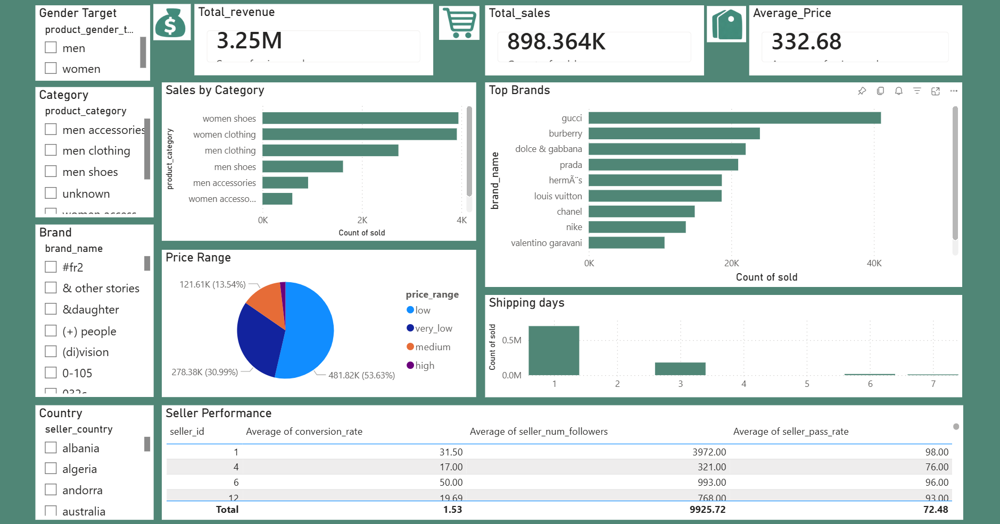

# 🛍️ E-Commerce Sales Analysis (SQL + Power BI)

## 📊 Project Overview
This project analyzes an e-commerce dataset using SQL and Power BI to generate business insights.

## 🛠 Tools Used
- SQL (MySQL)
- Power BI
- Python (Data Cleaning)

## 📌 Key Insights
## 🔍 Key Insights

- Women’s products dominate the platform in terms of listings, indicating a larger market presence in that segment.
- Despite higher listings in women’s category, analyzing conversion rates helps identify whether demand truly matches supply.
- Faster shipping times are associated with higher sales, showing that delivery speed significantly impacts customer purchase decisions.
- A small number of top brands contribute to a large share of total sales, indicating brand-driven purchasing behavior.
- Mid-range priced products tend to perform better, suggesting customers prefer a balance between price and quality.
- Certain product categories (such as dresses, jackets, etc.) consistently show higher sales, highlighting strong customer preferences.
- Sellers with higher follower counts and better pass rates tend to achieve better conversion rates, showing the importance of seller reputation.
- A noticeable portion of listed products remain unsold, indicating potential gaps in pricing strategy, product visibility, or demand alignment.

## 📊 Dashboard

## 📂 Project Structure
- SQL Queries for analysis
- Power BI dashboard
- Cleaned dataset (sample)

## 🚀 How to Run
1. Import dataset into MySQL
2. Run SQL queries
3. Connect Power BI to database
